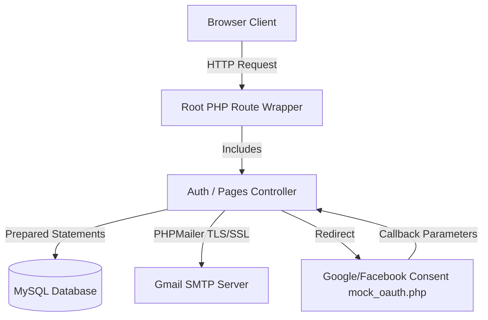

# 🐾 Pawganic Supplies

[](https://www.php.net/)
[](https://www.mysql.com/)
[](https://getbootstrap.com/)
[](https://github.com/PHPMailer/PHPMailer)

> A premium, full-featured PHP-based e-commerce platform for pet supplies, featuring secure authentication, automated transactional email delivery, and an interactive administrator dashboard.

---

## 📋 Table of Contents

- [Overview](#-overview)
- [System Architecture](#%EF%B8%8F-system-architecture)
- [Key Features](#-key-features)
- [Technical Highlights](#-technical-highlights)
- [Tech Stack](#-tech-stack)
- [Project Structure](#-project-structure)
- [Database Schema](#-database-schema)
- [Getting Started](#-getting-started)
  - [Prerequisites](#prerequisites)
  - [Installation](#installation)
  - [Local Overrides Configuration](#local-overrides-configuration)
  - [Database Setup](#database-setup)
- [Usage & Credentials](#-usage--credentials)
- [Security Features](#-security-features)
- [License](#-license)

---

## 📌 Overview

**Pawganic Supplies** is a robust e-commerce web application built for local pet stores. Leveraging a classic MVC-like file structure, it offers customers a responsive shopping experience (browsing organic pet food, toys, and accessories, maintaining wishlists, applying coupons, and walking through checkout) combined with a robust management dashboard for store administrators.

---

## 🏗️ System Architecture



---

## ✨ Key Features

### 🛒 Customer Hub
- **Authentication Gateway** — Standard sign-in/registration and social login integration.
- **Product Catalog** — Browsing and searching by category (`Food`, `Toys`, `Accessories`).
- **Wishlist & Favorites** — Dedicated wishlist storage to bookmark preferred supplies.
- **Shopping Cart** — Real-time quantity updating, coupon validation, and subtotal calculation.
- **Multi-Method Checkout** — Supports mock integrations for GCash, PayPal, Mastercard, Credit Card, and Apple Pay.
- **Order Tracker** — Complete personal transaction and delivery progress tracker.
- **Profile Customization** — Modify profile info, upload custom avatars, and track virtual balances.

### 🔧 Administrative Control Center
- **Statistical Dashboard** — High-level sales metrics, user count, and transaction logs.
- **Catalog Management** — Full CRUD actions for products (image uploads, inventory, description, and status).
- **Order Processing** — Fulfill, track, and update delivery statuses of all customer orders.
- **User Account Management** — Moderate user permissions and roles (`user` vs `admin`).
- **Discount & Coupons** — Create, modify, and monitor active promotional discount codes.
- **Live Database Maintenance** — Perform immediate raw database backups and downloads.

---

## 🛡️ Technical Highlights

### 1. SMTP Email Integration (PHPMailer)
All transactional emails (Registration Welcome, Purchase Confirmation, and Password Recovery resets) are routed through **PHPMailer** using SMTP over Port 465 (SSL). 
- **Inline Embedded Logo**: Embedded using CID tags (`cid:pagelogo`) to guarantee layout visibility in mail apps.
- **Letgo-inspired Minimalist Layout**: Minimalist email layouts featuring side-by-side header brand rows, centered body content, flat gold action buttons, and lowercase bold signatures.
- **Unicode Dash Resolution**: Native UTF-8 configurations to ensure em-dashes and characters render cleanly without broken encoding bytes.

### 2. Secure Password Recovery Flow
Implements a secure token-based forgot password recovery system:
- Generates random 32-character hex tokens.
- Hashing is performed via **SHA-256** before storing the token in the database, preventing database leaks from exposing active reset links.
- Set to auto-expire 1 hour after generation.

### 3. Google & Facebook Authentication Mockup
Includes custom mock OAuth consent screens (`mock_oauth.php`) for both Google and Facebook, providing a realistic sign-in transition:
- **Google Selector**: Displays an account selection card listing mock profiles.
- **Facebook Consent Dialog**: Shows a data-sharing review screen.
- **Smart Fallback**: The mock login automatically handles lookups for existing accounts (e.g. `user1`), falling back sequentially to other active accounts or the first database user to avoid authorization errors.
- **Auto-Registration**: Signing up with Google/Facebook automatically registers a unique username, assigns a **₱20,000.00** starting balance, delivers a welcome SMTP email, and establishes the active session.

### 4. Git-Protected Credentials (Local Config Overrides)
To prevent accidentally committing sensitive SMTP passwords or Google OAuth keys to Git, the configuration implements local overrides:
- **`config/config.local.php`**: Holds private keys locally and is fully excluded from commits via `.gitignore`.
- **`config/config.local.php.example`**: A safe template file tracked by Git.
- **`config/config.php`**: Automatically reads `config.local.php` first, falling back to generic placeholders if it doesn't exist.

---

## 🛠 Tech Stack

- **Backend**: PHP 8.2+ (with cURL & OpenSSL enabled)
- **Database**: MySQL / MariaDB 10.4+
- **Frontend**: HTML5, CSS3, Bootstrap 5.3
- **Libraries**: PHPMailer 6.9+
- **Icons**: Font Awesome 6.4

---

## 📁 Project Structure

```text
petv10/
├── admin/                  # Admin-only dashboard, inventory & user management
├── auth/                   # Authentication logic, login, register, mock OAuth
├── config/                 # Configurations, db connectors, SMTP templates
│   ├── config.local.php.example   # local config template
│   └── logs/               # Local PHP logs
├── database/               # SQL schema imports and database backups
├── includes/               # Shared handlers (PHPMailer, AJAX stock updates)
├── pages/                  # Customer-facing views (checkout, cart, profile)
├── assets/                 # Brand logo and page banners
├── uploads/                # User avatar uploads
├── .gitignore              # Ignored local config overrides and log dumps
├── index.php               # Front-controller wrapper
├── main.php                # Homepage
└── mock_oauth.php          # OAuth root router wrapper
```

---

## 🗄 Database Schema

| Table             | Description                                                             |
|-------------------|-------------------------------------------------------------------------|
| `users`           | User credentials, profile picture paths, roles, and virtual balances.   |
| `products`        | Product catalog with details, pricing, category, and inventory levels.  |
| `cart`            | User shopping cart items.                                               |
| `transactions`    | Completed transactions with billing, delivery details, and items.        |
| `password_resets` | Secure SHA-256 hashed recovery tokens and expiration timestamps.        |
| `login_attempts`  | Brute-force protection counter logs to lock out malicious IPs/usernames.|

---

## 🚀 Getting Started

### Prerequisites
- **XAMPP** (or any server stack with PHP 8.2+ and MySQL/MariaDB)
- **Composer** (Not required, PHPMailer is integrated locally)

### Installation
1. Extract or clone this repository to your XAMPP `htdocs` folder:
   ```bash
   C:\xampp\htdocs\petv10\
   ```
2. Start Apache and MySQL via the **XAMPP Control Panel**.

### Local Overrides Configuration
To configure email delivery and credentials locally:
1. Navigate to the `config/` directory.
2. Duplicate the file `config.local.php.example` and rename it to **`config.local.php`**:
   ```bash
   cp config/config.local.php.example config/config.local.php
   ```
3. Open `config.local.php` in a text editor and fill in your Gmail App Password and Google OAuth credentials:
   ```php
   define('SMTP_PASS', 'your-gmail-app-password');
   define('GOOGLE_CLIENT_ID', 'your-google-client-id');
   define('GOOGLE_CLIENT_SECRET', 'your-google-client-secret');
   ```

### Database Setup
1. Open phpMyAdmin at `http://localhost/phpmyadmin`.
2. Create a new database named **`pet_store_inventory`**.
3. Go to **Import**, choose **`pawganic_data.sql`** from the project root directory, and click import to load the pre-configured clean database setup.

---

## 🖥️ Usage & Credentials

### Access Links
* **Homepage**: `http://localhost/petv10/`
* **Shop**: `http://localhost/petv10/shop.php`
* **Admin Panel**: `http://localhost/petv10/admin/admin.php`

### Sample Login Credentials
* **Customer Account**:
  * Username: `user1`
  * Password: `user1`
* **Administrator Account**:
  * Username: `admin1`
  * Password: `admin1`

---

## 🔒 Security Features
- **Password Hashing** — Salting and hashing via `bcrypt` algorithms.
- **CSRF Token Validation** — Form validations checking state tokens.
- **Brute-Force Rate Limiting** — Automatically blocks login submissions for 15 minutes after 5 consecutive failures.
- **Directory Access Control** — `.htaccess` rules block direct web browsing of internal asset directories.

---

## 📄 License

This repository is built for educational and academic purposes. All rights reserved.

<div align="center">
  <sub>Pawganic Supplies &copy; 2026</sub>
</div>
